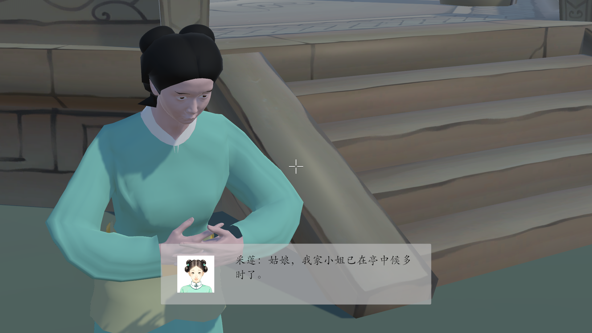

《流光与君书》

2025计算机设计大赛-数媒游戏组游戏设计作品

---

目录

- [项目简介](#项目简介)
- [功能特性](#功能特性)
- [效果截图](#效果截图)
- [环境与依赖](#环境与依赖)
- [快速开始](#快速开始)
  - [克隆仓库](#克隆仓库)
  - [导入 Unity](#导入-unity)
  - [运行方式](#运行方式)
- [项目结构](#项目结构)
- [开发者信息](#开发者信息)
- [版权与协议](#版权与协议)

---

## 项目简介

《流光与君书》是一款融合历史穿越与物理模拟的3D沉浸式交互体验游戏。玩家扮演一名现代物理学爱好者，机缘巧合下穿越至古代，与中国历史上的物理学学者、工匠等共同解决物理难题。

---

## 功能特性

核心玩法包含：  
①多线程对话系统：动态分支对话，玩家可以通过与古代物理学家的对话逐渐揭示他们的思想，玩家的选择和实验进度会影响剧情走向，从而解锁不同的对话和结局。
②物理引擎模拟：通过拖拽、点击、键盘输入等交互方式，玩家可以操控不同的物体，模拟现实世界中的物理现象；  
③跨时空解谜：玩家在游戏过程中穿梭时空裂缝与古人共同解谜，通过特定的对话和物理实验，结合古代智慧与现代科学知识共同解决难题；
④认识古代物理学先驱：通过与NPC的互动，玩家可以了解中国古代物理学家的故事。通过完成任务或解锁对话，玩家将学习科学理论和技术，不仅是学习知识，还能通过实际操作体验这些科学原理的应用。

---

## 效果截图

  
*图 1：游戏主场景*

  
*图 2：与NPC对话界面*

---

## 环境与依赖

工具名称	              类型	        用途说明	                                                            许可证类型
Unity                 用于实现物理模拟、三维场景渲染、角色控制、交互逻辑等功能。                             Unity 软件许可协议（非开源，遵守其使用条款）
Blender	              3D建模软件	    用于制作/修改部分游戏中的3D模型资源，如古亭、太湖石、实验道具、建筑等。	  开源（GNU GPL v2+）
Adobe After Effects	  动画/后期制作	用于制作开场动画、过场视频、墨滴特效、时间扭曲视觉表现等。	              商业授权（Adobe 订阅）

第三方 SDK/插件： 
  - Cinemachine（用于第一人称镜头控制）

---

## 快速开始

### 克隆仓库

```bash
git clone https://github.com/308321/land2.git
cd land2
